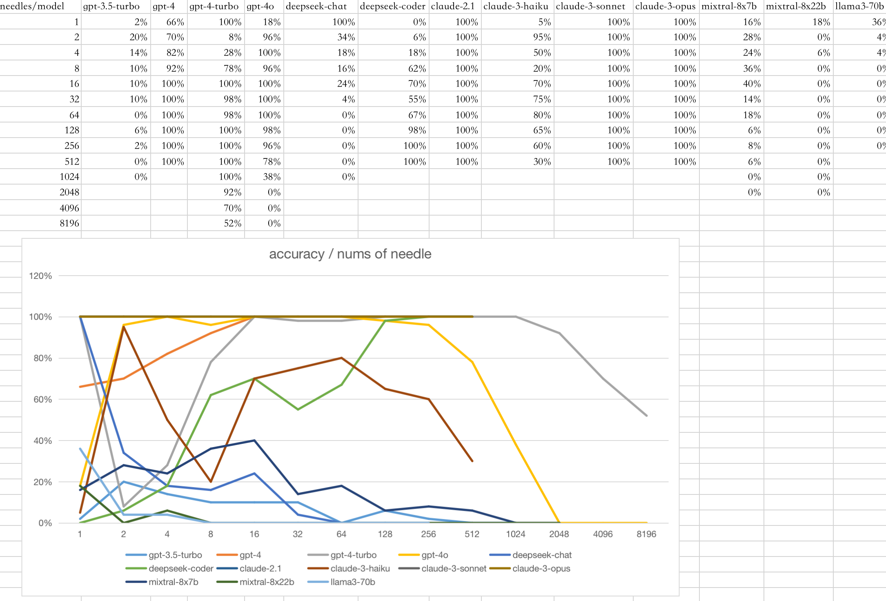

## Needle Not In A Haystack

Okay, I guess you guys are ready know about `Needle In A Haystack` challenge. But this time, I have a different challenge for you. I have a needle but I don't put it in the haystack yet, could LLM tell me that It's not in the haystack? or will it fall into hallucination? Let's see.

### Some Results
#### With 300 samples

Looks like the accuracy is 80% with 300 samples. but you know, it's not enough, I just tried 10 times.

#### With 3000 samples

It has been decreased to 20% with 3000 samples. I tried 10 times. :(
